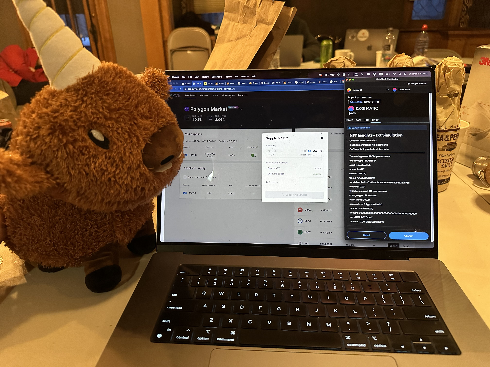
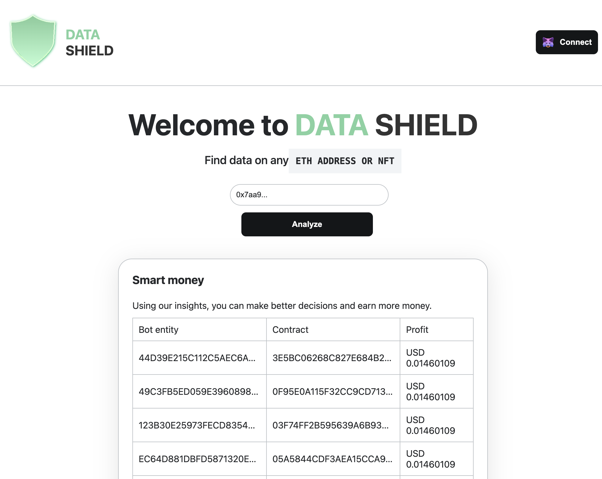
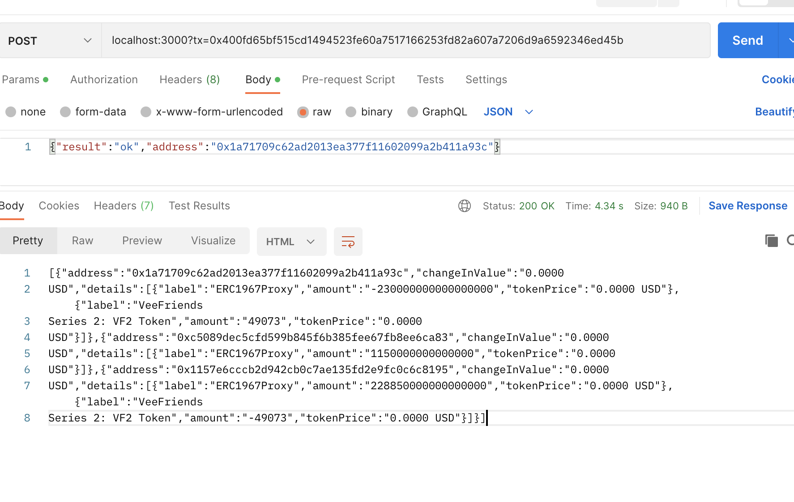
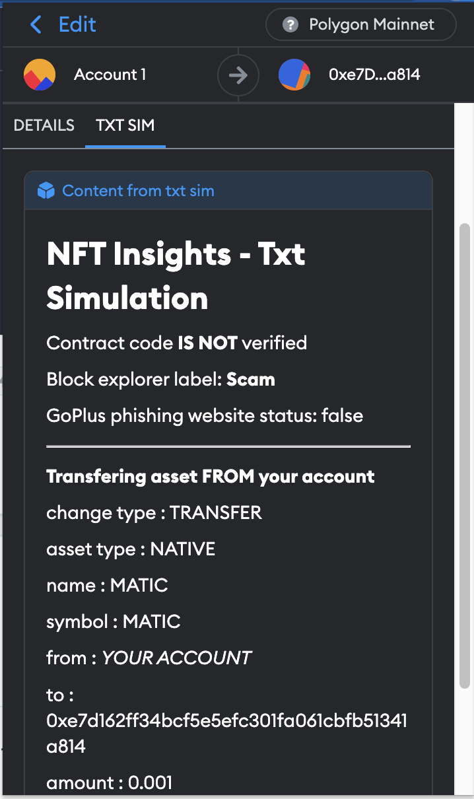

# ETHDener23-DataShield

Welcome to ETH Denver Data Shield repository! Go to [Data Shield](https://eth-dener23-data-shield.vercel.app) Now! And stop the crypto scams!

## Data Shield MetaMask Website
- Mantle Ethereum layer-2 transaction tracer
- We aggregated data to protect users, we used covalent to write a custom query to detect nft arbitrage (aka smart money)
- MetaMask Snap installation that was made from [Truffle Snaps Box](https://trufflesuite.com/boxes/metamask-snap-box/)

##### Mantle Ethereum layer-2 transaction tracer:

## Data Shield MetaMask Snap
- Etherscan API shows if contract source code has been verified
- Etherscan Labels indicate a category that an address, token, transaction or block page belongs to. Some examples of labels are "scam", "Tornado.cash". All labels are visible here https://polygonscan.com/labelcloud
- Go+ Security Phishing Site API to see if transaction was sent from a flagged website
- Transaction simulation shows all asset inflows and outflows from your crypto wallet

